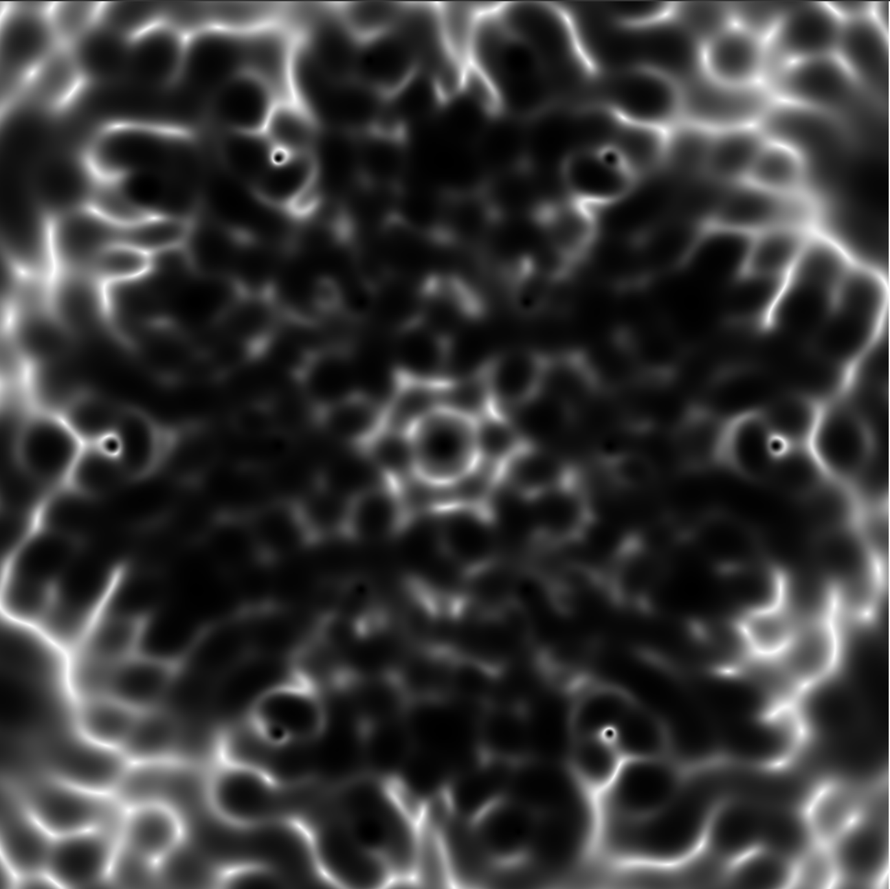

# monadic

GPU-accelerated 2D wave interference simulator. Place emitters on a canvas and watch interference patterns emerge in real time. Control frequency, phase, amplitude, decay, lattice layout, and color mode from the side panel.



Requires Rust and Cargo installed.

## Run

```sh
cargo run --release
```

## Install

```sh
cargo install --path .
monadic
```
